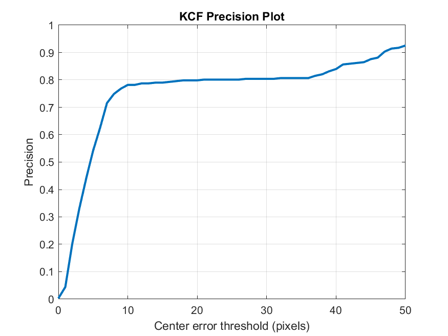
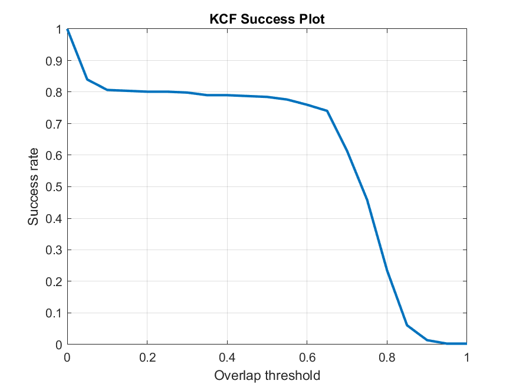
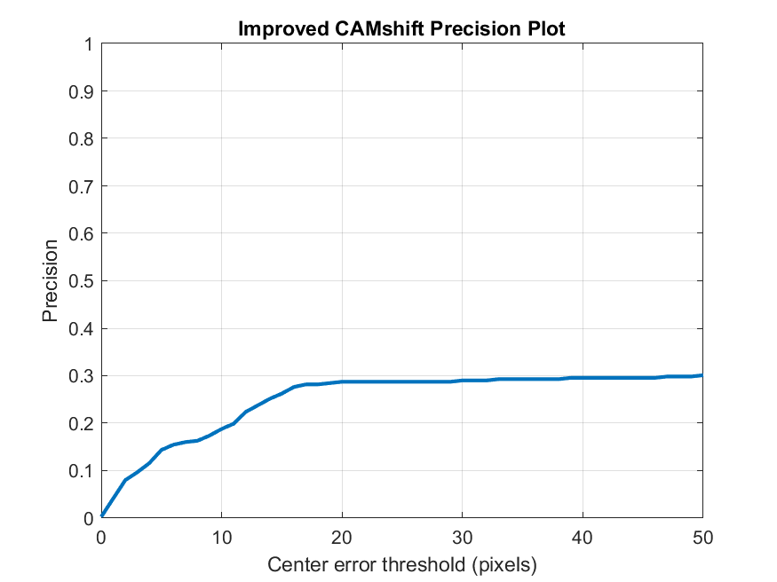
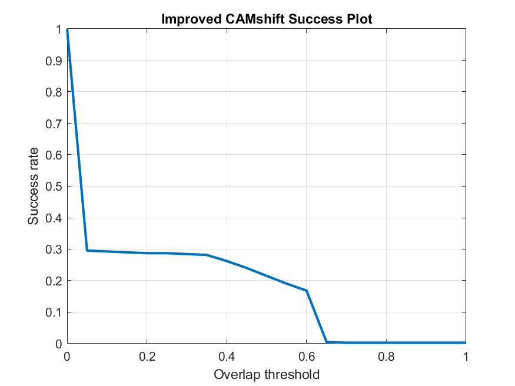

# CAMShift.NCC-Kalman

MATLAB project for motion-target tracking with three runnable workflows:

- Standard `KCF` tracking
- Grayscale `NCC + Kalman` tracking
- Classical preprocessing and motion detection baselines

The repository is organized for direct GitHub submission: source code is tracked, while datasets, large result files, archives, and local references are ignored.

## Highlights

- Four entry scripts for end-to-end execution
- OTB-style dataset adapter with default support for `Football`
- Exported `CLE`, `IoU`, `Precision`, `Success`, `AUC`, and `FPS`
- Lightweight tracked figures for repository preview
- Large local artifacts excluded through `.gitignore`

## Repository Layout

```text
.
|-- assets/
|   `-- figures/
|-- data/
|   `-- README.md
|-- docs/
|   |-- experiment-report.md
|   `-- references/
|-- experiments_visualization/
|-- improved_camshift/
|-- kcf_tracking/
|-- preprocessing_detection/
|-- utils/
|-- main_basic_detection.m
|-- main_KCF_tracking.m
|-- main_improved_CAMshift_tracking.m
`-- main_algorithm_comparison.m
```

## Requirements

- MATLAB `R2020b` or newer
- Image Processing Toolbox
- Computer Vision Toolbox

## Quick Start

1. Open MATLAB in the repository root.
2. Run one of the entry scripts:

```matlab
main_basic_detection
main_KCF_tracking
main_improved_CAMshift_tracking
main_algorithm_comparison
```

3. Put your local OTB-style sequence under:

```text
data/otb/Football/
  groundtruth_rect.txt
  img/
    0001.jpg
    0002.jpg
    ...
```

Dataset files are intentionally not tracked in Git.

## Current Run Snapshot

Latest verified run on the local `Football` sequence:

| Method | Precision@20 | AUC | Mean CLE | Mean IoU |
|---|---:|---:|---:|---:|
| KCF | 0.7983 | 0.6082 | 12.5876 | 0.6083 |
| Improved CAMShift | 0.2873 | 0.1810 | 169.1677 | 0.1647 |

## Preview Figures

### KCF





### Improved CAMShift





## Notes On Tracked vs Local Files

- Tracked:
  - Source code
  - Lightweight markdown docs
  - Curated PNG preview figures
- Ignored:
  - Raw datasets
  - Extracted image sequences
  - `.mat` result dumps
  - Archives and large reference files
  - Internal planning artifacts

## Documentation

- Data setup: [data/README.md](data/README.md)
- Experiment summary: [docs/experiment-report.md](docs/experiment-report.md)
- Reference links: [docs/references/README.md](docs/references/README.md)

## References

- KCF original paper: [arXiv](https://arxiv.org/abs/1404.7584)
- OTB benchmark: [CVF Open Access](https://www.cv-foundation.org/openaccess/content_cvpr_2013/html/Wu_Online_Object_Tracking_2013_CVPR_paper.html)
- OTB dataset download reference: [OTB-dataset GitHub](https://github.com/prosti221/OTB-dataset)
- CAMShift background reference: [Bradski PDF](https://www.cse.psu.edu/~rtc12/CSE598G/papers/camshift.pdf)
