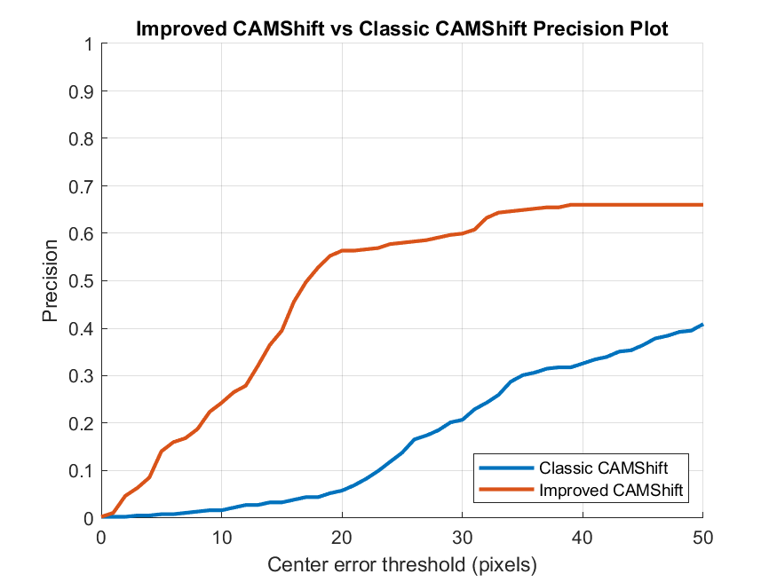
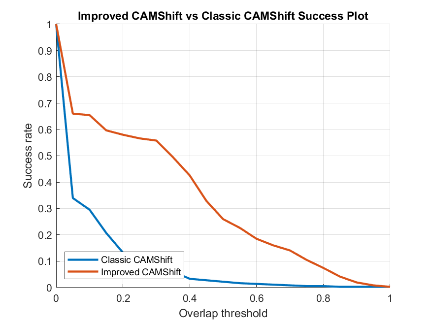
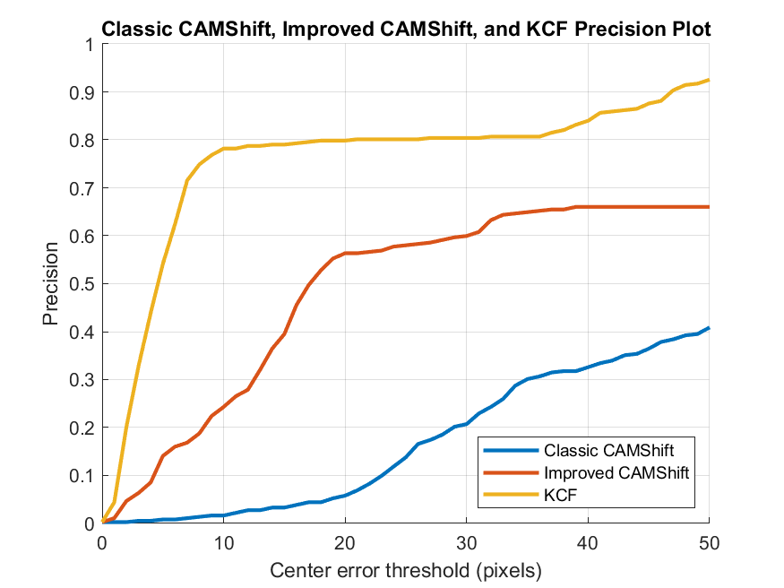
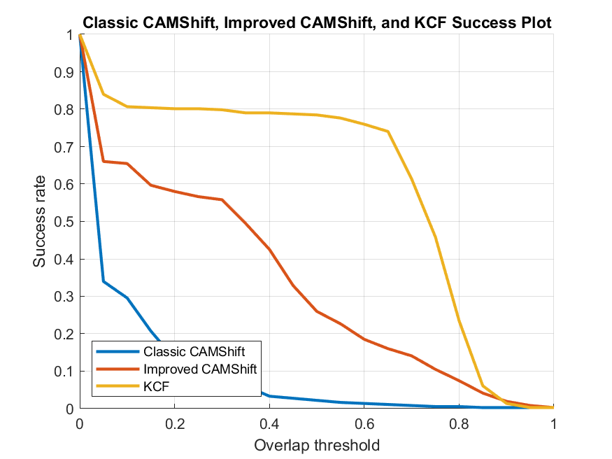

# Experiment Report

## Scope

This report summarizes the current local run of the tracking project on the `Football` sequence using three trackers:

- `Classic CAMShift`
- `Improved CAMShift` based on grayscale `NCC + Kalman`
- `KCF`

## Runtime Environment

- MATLAB `R2024b`
- Image Processing Toolbox
- Computer Vision Toolbox

## Evaluation Metrics

- `CLE`: center location error
- `IoU`: overlap ratio
- `Precision@20`: fraction of frames with center error within 20 pixels
- `AUC`: area under the success curve
- `FPS`: average runtime throughput estimated from per-frame timing

## Current Result Summary

| Method | Precision@20 | AUC | Mean CLE | Mean IoU | FPS |
|---|---:|---:|---:|---:|---:|
| Classic CAMShift | 0.0580 | 0.0934 | 50.4994 | 0.0778 | 210.17 |
| Improved CAMShift | 0.5635 | 0.3294 | 71.0816 | 0.3200 | 214.72 |
| KCF | 0.7983 | 0.6082 | 12.5876 | 0.6083 | 326.74 |

## Observations

- `Improved CAMShift` now clearly outperforms `Classic CAMShift` on both `Precision@20` and `AUC`.
- `KCF` remains the strongest tracker on this sequence in both location accuracy and overlap stability.
- The current state matches the intended comparison story for this repository: `Classic CAMShift < Improved CAMShift < KCF`.

## Tracked Preview Figures

### CAMShift Family Precision



### CAMShift Family Success



### All Trackers Precision



### All Trackers Success



## Reproducibility

Run the following from the repository root in MATLAB:

```matlab
main_KCF_tracking
main_improved_CAMshift_tracking
main_algorithm_comparison
```

Generated local outputs are written under `results/`, which is ignored by Git by default.
